# Collision Detection

A robot arm waving through open air is easy. The hard part is guaranteeing it
never crashes into the table, the human operator, or itself. Every motion
planner, servo controller, and trajectory validator in kinetic depends on
collision detection to answer one question: "is this configuration safe?"

Getting that answer wrong has consequences. A false negative (missed collision)
means damaged hardware or injured people. A false positive (phantom collision)
means the robot freezes or takes a wasteful detour. Kinetic's collision system
is designed to be fast enough for real-time control loops and conservative
enough to never miss a real collision.

```mermaid
graph TB
    Q[Is config safe?] --> FK[FK all links]
    FK --> Sphere[Update sphere positions]
    Sphere --> Self{Self-collision?}
    Self -->|Check| ACM[Filter by ACM<br/>skip adjacent pairs]
    ACM --> SIMD[SIMD sphere-sphere<br/>AVX2 / NEON / scalar]

    Sphere --> Env{Environment?}
    Env --> CAPT[CAPT broadphase<br/>O&#40;1&#41; grid lookup]
    CAPT -->|Near| LOD{Distance?}
    LOD -->|> 10cm| SphereOnly[Sphere check<br/>~500ns]
    LOD -->|2-10cm| Convex[Convex hull<br/>~5-20us]
    LOD -->|< 2cm| Mesh[Exact mesh<br/>~50us]

    SIMD --> Result{Collision?}
    SphereOnly --> Result
    Convex --> Result
    Mesh --> Result
    Result -->|No| Safe[Safe]
    Result -->|Yes| Blocked[Blocked]

    style Safe fill:#3ddc84,color:#000
    style Blocked fill:#ff6b6b,color:#fff
    style SIMD fill:#ffd93d,color:#000
    style CAPT fill:#ffd93d,color:#000
```



## Two Approaches to Collision Geometry

Robot links are complex 3D shapes -- cast aluminum housings, cable bundles,
custom brackets. There are two fundamental strategies for checking whether
these shapes intersect with obstacles.

**Exact mesh collision** loads the full triangle mesh of each link and tests
mesh-mesh intersection. This gives precise answers but is expensive: a single
check can take 10-50 microseconds depending on mesh complexity. For a motion
planner that evaluates thousands of configurations per millisecond, that cost
is prohibitive.

**Sphere approximation** replaces each link with a set of bounding spheres.
Checking whether two spheres overlap is a single distance comparison --
trivially fast. The trade-off is conservatism: spheres overestimate the
link volume, so the system may report collisions that the exact mesh would
not. In practice, this conservatism is a feature, not a bug. A small safety
margin prevents the robot from threading needles between obstacles.

Kinetic uses sphere approximation as its primary collision backend, with
exact mesh available as a refinement layer when precision matters.

## RobotSphereModel and SpheresSoA

`RobotSphereModel` approximates each link of a robot with bounding spheres,
generated from the URDF collision geometry (boxes, cylinders, meshes):

```rust
use kinetic_collision::{RobotSphereModel, SphereGenConfig};

// Coarse: fewer spheres, faster checks
let model = RobotSphereModel::from_robot(&robot, &SphereGenConfig::coarse());

// Fine: tighter fit, more accurate but slower
let model = RobotSphereModel::from_robot(&robot, &SphereGenConfig::fine());
```

The `SphereGenConfig` controls the density-accuracy trade-off. Coarse mode
uses up to 8 spheres per geometry primitive with a 10cm max radius. Fine mode
uses up to 64 spheres at 2cm max radius. The default sits in between.

Internally, all sphere data is stored in `SpheresSoA` -- a Structure-of-Arrays
layout where the x, y, z coordinates and radii live in separate contiguous
arrays rather than interleaved structs. This layout is critical for SIMD
vectorization: the CPU can load 4 x-coordinates at once (on AVX2) and
process them in a single instruction.

```rust
// SpheresSoA stores spheres as parallel arrays:
//   x:       [x0, x1, x2, x3, ...]
//   y:       [y0, y1, y2, y3, ...]
//   z:       [z0, z1, z2, z3, ...]
//   radius:  [r0, r1, r2, r3, ...]
//   link_id: [l0, l1, l2, l3, ...]
```

## CAPT: Sub-10ns Environment Queries

The Collision-Affording Point Tree (CAPT) is a 3D voxel grid that
pre-computes the answer to "how close is this point to any obstacle?"
Each cell stores the minimum clearance -- the largest sphere that could be
placed at that cell center without intersecting an obstacle.

Checking whether a sphere at position (x, y, z) with radius r collides
with the environment reduces to a single grid lookup:

```text
collision = grid[ix][iy][iz] < r
```

Build cost is O(N * V) where N is the number of obstacles and V is the number
of affected voxels. But query cost is O(1) per point -- a single array index
plus a comparison. For a robot with 100 spheres, the entire environment
collision check takes under a microsecond.

```rust
use kinetic_collision::{CollisionEnvironment, CollisionPointTree, AABB};

let env = CollisionEnvironment::build(
    obstacle_spheres,
    0.05,                       // 5cm grid resolution
    AABB::symmetric(10.0),      // 20m x 20m x 20m workspace
);

let colliding = env.check_collision(&robot_spheres);
let clearance = env.min_distance(&robot_spheres);
```

## SIMD Acceleration

Distance calculations between sphere sets are embarrassingly parallel.
Kinetic dispatches to the widest available SIMD instruction set at runtime:

| Tier   | Width   | Throughput      | Platform         |
|--------|---------|-----------------|------------------|
| AVX2   | 256-bit | 4 f64 per cycle | x86_64           |
| NEON   | 128-bit | 2 f64 per cycle | aarch64 (always) |
| Scalar | 64-bit  | 1 f64 per cycle | All platforms    |

Detection happens once at startup. On x86_64, the runtime checks for the
`avx2` feature flag. On aarch64, NEON is mandatory and always used. There is
no configuration needed -- the fastest available path is selected
automatically.

## Self-Collision and the ACM

A robot can collide with itself. Consider a 7-DOF arm folding back on itself
-- the wrist might strike the shoulder. Self-collision checking tests every
pair of robot link spheres against each other.

But adjacent links (connected by a joint) always geometrically overlap at the
joint origin. Checking these pairs would report permanent false collisions.
The Allowed Collision Matrix (ACM) solves this by listing link pairs that
should be skipped:

```rust
use kinetic_collision::AllowedCollisionMatrix;

// Auto-built from URDF: skips all parent-child link pairs
let acm = AllowedCollisionMatrix::from_robot(&robot);

// Manually allow additional pairs (e.g., gripper + grasped object)
acm.allow("left_finger", "bolt");
```

The ACM is resolved to index-based pairs (`ResolvedACM`) for fast runtime
lookups. During self-collision checking, any pair listed in the ACM is
skipped without computing distances.

## Two-Tier LOD: Speed When Possible, Precision When Needed

For most configurations, spheres give the right answer quickly. But near
obstacles, the conservatism of sphere approximation can be too aggressive --
rejecting configurations that are actually safe. The `TwoTierCollisionChecker`
combines both approaches:

1. **Sphere broadphase** (~500ns): Check all sphere pairs using SIMD.
   If clearance is large, return immediately -- no collision.
2. **Mesh narrowphase** (<50us): If sphere distance is within the
   `refinement_margin`, call the exact parry3d-f64 mesh backend for a
   precise answer.

```rust
use kinetic_collision::{TwoTierCollisionChecker, SphereGenConfig};

let checker = TwoTierCollisionChecker::new(
    &robot,
    &SphereGenConfig::default(),
    0.02,  // refinement margin: 2cm triggers exact check
    0.01,  // safety margin: 1cm added to all distances
);
```

In practice, 99% of queries are resolved by the sphere broadphase. The mesh
narrowphase fires only for near-contact configurations, keeping the average
check time under 1 microsecond.

## Continuous Collision Detection (CCD)

Discrete collision checks test a single configuration. But a robot moving
between two safe configurations might pass through an obstacle in between --
the "tunneling" problem. CCD checks the entire swept volume between two
configurations using conservative advancement:

1. Start at t=0. Interpolate configuration, compute FK, check clearance.
2. If clearance d > 0, advance time by d / v_max (maximum sphere velocity).
3. Repeat until collision is found or t > 1.

The conservative guarantee: the advancement step never exceeds the
clearance-to-velocity ratio, so collisions cannot be skipped.

```rust
use kinetic_collision::{ContinuousCollisionDetector, CCDConfig};

let ccd = ContinuousCollisionDetector::new(
    &sphere_model, &environment, CCDConfig::default()
);

// Returns Some(t) if collision at time t in [0, 1], None if safe
let collision_time = ccd.check(&q_start, &q_end, &fk_poses_start);
```

## See Also

- [Motion Planning](./motion-planning.md) -- how planners use collision checking to find safe paths
- [Reactive Control](./reactive-control.md) -- collision deceleration in the servo loop
- [Robots and URDF](./robots-and-urdf.md) -- where collision geometry comes from
