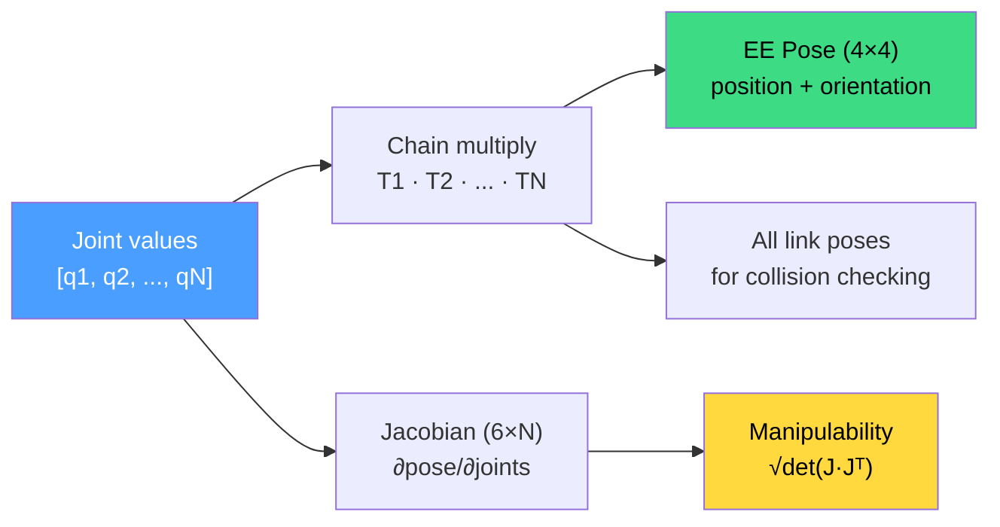

# Forward Kinematics

Forward kinematics (FK) answers the most fundamental question in robotics: given a set of joint values, where is the end-effector? It transforms a vector of joint angles (and/or displacements) into a 6D pose in Cartesian space.



## What FK computes

A robot arm is a chain of rigid links connected by joints. Each joint has a fixed origin (where it sits relative to its parent link) and a variable motion (rotation or translation). FK multiplies these transforms from the base link to the tip link, accumulating the total transform.

For a chain with N joints:

```
T_ee = T_origin_1 * T_motion_1 * T_origin_2 * T_motion_2 * ... * T_origin_N * T_motion_N
```

Each `T_origin_i` is a fixed SE(3) transform (from the URDF `<origin>` element). Each `T_motion_i` depends on the joint type and current value:

- **Revolute / Continuous**: rotation around the joint axis by `q_i` radians.
- **Prismatic**: translation along the joint axis by `q_i` meters.
- **Fixed**: identity (no motion).

The result `T_ee` is the end-effector pose in the base frame -- a `Pose` in kinetic.

## The kinematic chain

FK requires knowing which joints to traverse. A `KinematicChain` extracts the ordered set of joints from a base link to a tip link. You can extract one manually or let kinetic auto-detect it from planning groups:

```rust
use kinetic_kinematics::KinematicChain;
use kinetic_robot::Robot;

let robot = Robot::from_name("ur5e")?;

// Explicit chain extraction
let chain = KinematicChain::extract(&robot, "base_link", "ee_link")?;
println!("DOF: {}", chain.dof);           // 6
println!("All joints: {}", chain.all_joints.len()); // includes fixed

// Auto-detect from planning groups
let chain = KinematicChain::auto_detect(&robot)?;
```

The chain distinguishes between `all_joints` (every joint in the path, including fixed) and `active_joints` (only joints that move). The `dof` is the count of active joints, which matches the length of the joint-value vector FK expects.

## Computing FK

The primary FK function takes a robot, a chain, and joint values:

```rust
use kinetic_kinematics::forward_kinematics;

let robot = Robot::from_name("ur5e")?;
let chain = KinematicChain::extract(&robot, "base_link", "ee_link")?;

// Compute end-effector pose
let joints = [0.0, -1.5708, 1.5708, 0.0, 1.5708, 0.0];
let ee_pose = forward_kinematics(&robot, &chain, &joints)?;

println!("Position: {:?}", ee_pose.translation());
println!("Orientation (RPY): {:?}", ee_pose.rpy());
```

The convenience trait `RobotKinematics` adds FK directly on `Robot`, auto-detecting the chain:

```rust
use kinetic_kinematics::RobotKinematics;

let robot = Robot::from_name("franka_panda")?;
let pose = robot.fk(&[0.0, -0.7854, 0.0, -2.3562, 0.0, 1.5708, 0.7854])?;
```

## All-links FK

Sometimes you need every link's pose, not just the end-effector. `forward_kinematics_all` returns a `Vec<Pose>` with one entry per link in the chain (including the base):

```rust
use kinetic_kinematics::forward_kinematics_all;

let poses = forward_kinematics_all(&robot, &chain, &joints)?;
// poses[0] = base link (identity if root)
// poses[1] = after first joint
// ...
// poses[N] = end-effector (same as forward_kinematics result)
```

This is used by collision checking (each link needs a pose for its collision geometry), visualization (rendering every link), and Jacobian computation (needs joint-frame positions).

## Batch FK

When evaluating many configurations (e.g., during sampling-based planning), `fk_batch` avoids per-call overhead:

```rust
use kinetic_kinematics::fk_batch;

// 3 configurations for a 6-DOF arm = 18 values
let configs = vec![
    0.0, 0.0, 0.0, 0.0, 0.0, 0.0,     // config 0
    0.5, -0.3, 0.8, 0.0, 1.0, -0.5,    // config 1
    1.0, 1.0, -1.0, 0.5, 0.0, 0.5,     // config 2
];
let poses = fk_batch(&robot, &chain, &configs, 3)?;
// poses[0], poses[1], poses[2] = EE pose for each config
```

## The Jacobian

The Jacobian is a 6-by-DOF matrix that maps joint velocities to end-effector spatial velocity:

```
[v_x]       [          ]   [q_dot_1]
[v_y]       [          ]   [q_dot_2]
[v_z]   =   [    J     ] * [  ...  ]
[w_x]       [          ]   [q_dot_N]
[w_y]       [          ]
[w_z]       [          ]
```

Rows 0-2 are linear velocity (m/s). Rows 3-5 are angular velocity (rad/s). Each column corresponds to one active joint.

For a **revolute** joint at position p_j with axis z_j:
- Linear column: z_j x (p_ee - p_j) -- the tangential velocity at the EE due to rotation
- Angular column: z_j -- the rotation axis itself

For a **prismatic** joint with axis z_j:
- Linear column: z_j -- translation direction
- Angular column: zero -- prismatic motion does not rotate

```rust
use kinetic_kinematics::jacobian;

let j = jacobian(&robot, &chain, &joints)?;
println!("Jacobian shape: {}x{}", j.nrows(), j.ncols()); // 6x6 for UR5e
```

The Jacobian is central to robotics. IK solvers invert it (approximately) to find joint updates. Velocity control uses it to convert desired end-effector velocities to joint commands. Singularity analysis examines when it loses rank.

## Manipulability

The manipulability index quantifies how dexterous the robot is at a given configuration. It uses Yoshikawa's measure:

```
w = sqrt(det(J * J^T))
```

- **w > 0**: the robot can move in all directions. Higher is better.
- **w = 0**: the robot is at a singularity -- it has lost the ability to move in at least one direction.
- **w near 0**: approaching singularity -- motion in some direction requires very high joint velocities.

For under-actuated chains (DOF < 6), kinetic computes the product of singular values instead, which handles rank deficiency gracefully.

```rust
use kinetic_kinematics::manipulability;

let m = manipulability(&robot, &chain, &joints)?;
if m < 0.001 {
    println!("Warning: near singularity (manipulability = {})", m);
}
```

Manipulability is used as a null-space objective in IK (maximize dexterity while reaching the target) and as a cost in planning (prefer paths that stay away from singularities).

## Singularities

A singularity occurs when the Jacobian loses rank (manipulability drops to zero). At a singularity, the robot cannot generate velocity in some Cartesian direction, IK becomes ill-conditioned, and solutions may jump discontinuously. Common types: shoulder (wrist center on base axis), elbow (arm fully extended), and wrist (two wrist axes align). Kinetic's IK solvers handle singularities through damping (DLS) or avoidance (null-space objectives). The `IKSolution::condition_number` field reports Jacobian conditioning at the solution.

## How joint types affect FK

Each joint type contributes a different transform to the chain. **Revolute/Continuous** joints rotate around their axis by the joint value in radians. **Prismatic** joints translate along their axis by the joint value in meters. **Fixed** joints contribute their origin transform but no motion. A chain with mixed joint types works identically -- FK multiplies each transform in sequence:

```rust
// Mixed chain: revolute + prismatic
let chain = KinematicChain::extract(&robot, "base", "slider")?;
// joint[0] = rotation (radians), joint[1] = extension (meters)
let pose = forward_kinematics(&robot, &chain, &[1.57, 0.15])?;
```

## See Also

- [Glossary](./glossary.md) — definitions of FK, Jacobian, manipulability, singularity, and DOF
- [Coordinate Frames](./coordinate-frames.md) — the SE(3) transforms that FK chains together
- [Robots and URDF](./robots-and-urdf.md) — where joint origins and axes come from
- [Inverse Kinematics](./inverse-kinematics.md) — the reverse problem: pose to joints
- [Trajectory Generation](./trajectory-generation.md) — timing the paths that FK validates
