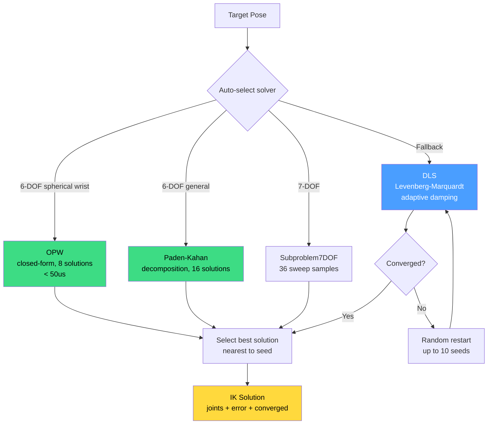

# Inverse Kinematics

Inverse kinematics (IK) answers the question: given a desired end-effector pose, what joint values place the tool there? It is the reverse of forward kinematics, and it is fundamentally harder.

## Why IK is hard

Forward kinematics is a function: one set of joint values produces exactly one pose. IK is not a function -- it is a relation with three complications:

1. **Multiple solutions**: A 6-DOF arm typically has up to 8 or even 16 configurations that all place the end-effector at the same pose. Think of an elbow-up vs. elbow-down posture reaching the same point.

2. **No solution**: If the target pose is outside the robot's workspace (too far, behind the base, or requiring an orientation the kinematics cannot produce), no joint values exist.

3. **Singularities**: At certain configurations, the Jacobian loses rank. Near singularities, tiny changes in target pose require enormous joint-velocity changes, and iterative solvers become unstable.

These properties make IK one of the most studied problems in robotics. Kinetic provides multiple solver strategies, each suited to different robot geometries and use cases.



## Analytical solvers

Analytical solvers exploit the specific geometry of a robot to compute closed-form solutions. They are fast (microseconds), exact (no iteration, no convergence tolerance), and return all solutions.

### OPW: spherical wrist robots

The OPW (Ortho-Parallel-Wrist) solver handles the most common industrial robot geometry: 6 revolute joints where the last three axes intersect at a point (the wrist center). This structure decouples position from orientation:

1. **Wrist center** is computed from the target pose and a pre-extracted tool offset.
2. **Position IK** (joints 1-3) is solved using arm-plane geometry and the law of cosines.
3. **Orientation IK** (joints 4-6) is solved via Euler decomposition of the remaining rotation.

This yields up to 2 x 2 x 2 = 8 solutions. The solver selects the one closest to the seed configuration.

Performance: under 50 microseconds, typically under 10 microseconds. No iteration.

```rust
use kinetic_kinematics::{solve_ik, IKConfig, IKSolver};

let config = IKConfig {
    solver: IKSolver::OPW,
    ..Default::default()
};
let solution = solve_ik(&robot, &chain, &target_pose, &config)?;
// solution.joints: the best of up to 8 analytical solutions
```

OPW covers UR (UR3e through UR30), ABB, KUKA KR, Fanuc, xArm6, and most other 6-DOF industrial arms with a spherical wrist.

### Paden-Kahan subproblem decomposition

For 6-DOF robots whose geometry does not match OPW assumptions but whose joints can be decomposed into canonical geometric subproblems, kinetic uses Paden-Kahan decomposition:

- **Subproblem 1**: rotation around a single axis to align two points.
- **Subproblem 2**: rotation around two intersecting axes.
- **Subproblem 3**: rotation to reach a specified distance.

The solver decomposes the full IK problem into a sequence of subproblems, each with a closed-form solution. Up to 16 solutions are returned.

```rust
let config = IKConfig {
    solver: IKSolver::Subproblem,
    ..Default::default()
};
```

### 7-DOF subproblem decomposition

For 7-DOF arms (e.g., Franka Panda, KUKA iiwa), one joint is redundant. The 7-DOF subproblem solver sweeps the redundant joint across its range, solving the resulting 6-DOF problem analytically at each sample point. The `num_samples` parameter controls sweep resolution (default 36, meaning every 10 degrees).

```rust
let config = IKConfig {
    solver: IKSolver::Subproblem7DOF { num_samples: 72 },
    ..Default::default()
};
```

## Iterative solvers

When the robot's geometry does not admit an analytical solution, or when you need to handle constraints and secondary objectives, iterative solvers converge numerically.

### DLS (Damped Least Squares)

DLS is kinetic's default iterative solver. It uses a Levenberg-Marquardt approach: at each iteration, compute the 6D pose error, then update joint values using the damped pseudo-inverse of the Jacobian:

```
delta_q = J^T * (J * J^T + lambda^2 * I)^-1 * error
```

The damping factor `lambda` prevents instability near singularities. Higher damping = more stable but slower convergence. Kinetic uses adaptive damping that increases near singularities.

```rust
let config = IKConfig {
    solver: IKSolver::DLS { damping: 0.05 },
    max_iterations: 100,
    position_tolerance: 1e-4,    // 0.1 mm
    orientation_tolerance: 1e-3, // ~0.06 degrees
    ..Default::default()
};
let solution = solve_ik(&robot, &chain, &target, &config)?;
```

DLS converges well for most configurations. Near singularities, it sacrifices precision for stability -- the `IKSolution::degraded` flag indicates when the solver fell back to a less accurate transpose method.

### FABRIK (Forward And Backward Reaching IK)

FABRIK is a geometric IK solver that does not use the Jacobian at all. Instead, it alternates between:

1. **Forward pass**: starting from the end-effector, adjust each joint position to reach toward the target.
2. **Backward pass**: starting from the base, adjust each joint position to satisfy link-length constraints.

FABRIK is naturally position-focused. It converges quickly for position-only IK and handles long chains well. Orientation is refined after position convergence.

```rust
let config = IKConfig {
    solver: IKSolver::FABRIK,
    max_iterations: 200,
    ..Default::default()
};
```

### SQP and Bio-IK

**SQP** (Sequential Quadratic Programming) formulates IK as a constrained optimization, naturally handling constraints like keeping a cup upright. **Bio-IK** uses a population-based evolutionary strategy (CMA-ES inspired) that is particularly effective for highly redundant robots (7+ DOF), multi-objective IK, and escaping local minima that trap gradient-based solvers.

## Auto-selection

With `IKSolver::Auto` (the default), kinetic picks the best solver automatically. It first checks the robot's `kinetic.toml` preference. If that is not set or not compatible, it tests: OPW (if 6-DOF spherical wrist), then Subproblem (if 6-DOF decomposable), then Subproblem7DOF (if 7-DOF), then falls back to DLS. Built-in robots have preferences pre-configured.

```rust
let ur5 = Robot::from_name("ur5e")?;
let sol = ur5.ik(&target)?;  // auto-selects OPW (6-DOF spherical wrist)

let panda = Robot::from_name("franka_panda")?;
let sol = panda.ik(&target)?;  // auto-selects Subproblem7DOF or DLS
```

## Null-space objectives

For redundant robots (DOF > 6), the null space is the set of joint velocities that produce zero end-effector motion. This internal reconfigurability can be exploited for secondary objectives:

- **Manipulability** (`NullSpace::Manipulability`): bias toward configurations with high Yoshikawa manipulability, staying away from singularities.
- **Joint centering** (`NullSpace::JointCentering`): bias toward mid-range joint values, avoiding joint limits.
- **Minimal displacement** (`NullSpace::MinimalDisplacement`): stay close to the seed configuration, producing the smallest motion.

```rust
use kinetic_kinematics::{IKConfig, NullSpace};

let config = IKConfig {
    null_space: Some(NullSpace::JointCentering),
    ..Default::default()
};
```

Null-space objectives do not affect whether IK converges -- they only influence which of the infinite solutions the solver finds.

## IKConfig and IKSolution

`IKConfig` controls solver selection, convergence criteria, and secondary objectives. `IKSolution` reports the result with diagnostics for hardware safety.

```rust
use kinetic_kinematics::{IKConfig, IKSolver, IKMode, NullSpace};

let config = IKConfig {
    solver: IKSolver::Auto,           // which solver
    mode: IKMode::Full6D,             // Full6D, PositionOnly, or PositionFallback
    max_iterations: 100,              // iterative solver limit
    position_tolerance: 1e-4,         // 0.1 mm
    orientation_tolerance: 1e-3,      // ~0.06 degrees
    check_limits: true,               // enforce joint limits
    seed: Some(vec![0.0; 7]),         // starting config
    null_space: None,                 // secondary objective
    num_restarts: 8,                  // random restarts to escape local minima
};

let solution = solve_ik(&robot, &chain, &target, &config)?;
// solution.converged    — did it meet tolerance?
// solution.degraded     — did DLS fall back to transpose near singularity?
// solution.condition_number — Jacobian conditioning (<50 good, >100 marginal, >1000 singular)
```

Three IK modes are available: **Full6D** (default, matches both position and orientation), **PositionOnly** (ignores orientation -- useful for vacuum grippers), and **PositionFallback** (tries Full6D, retries with PositionOnly if it fails). Use `IKConfig::position_only()` or `IKConfig::with_fallback()` as shorthands.

For batch solving, `solve_ik_batch` processes multiple targets in one call, returning `Vec<Option<IKSolution>>`.

## See Also

- [Glossary](./glossary.md) — definitions of IK, DLS, FABRIK, OPW, null space, singularity, and workspace
- [Forward Kinematics](./forward-kinematics.md) — the forward problem that IK inverts; Jacobian and manipulability
- [Coordinate Frames](./coordinate-frames.md) — the Pose type that IK targets
- [Robots and URDF](./robots-and-urdf.md) — how robot geometry determines which IK solver applies
- [Motion Planning](./motion-planning.md) — planners that call IK to evaluate candidate configurations
- [Trajectory Generation](./trajectory-generation.md) — timing the joint-space paths that IK produces
