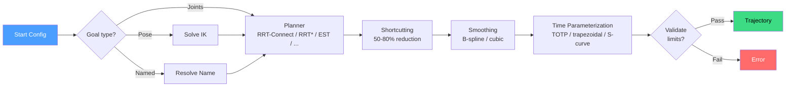

# Motion Planning

Motion planning answers a deceptively simple question: given a robot's
current joint configuration and a desired goal, find a sequence of
configurations that moves the robot from one to the other without hitting
anything. The difficulty is that "without hitting anything" turns a geometric
path problem into a search through a high-dimensional space riddled with
forbidden regions.



## Configuration Space

A robot with n joints has n degrees of freedom. Each joint angle is one
dimension, and the full set of joint angles defines a point in
**configuration space** (C-space). For a 6-DOF arm, C-space is a
6-dimensional hypercube where each axis spans that joint's limits.

An obstacle in the physical workspace (a table, a wall) maps to a
complicated forbidden region in C-space. The shape of this region depends
on the robot's geometry and kinematics -- a single box in the workspace
can produce a tangled, non-convex volume in C-space. This is why planning
directly in workspace coordinates does not work: the forbidden regions are
too complex to represent analytically. Instead, planners explore C-space by
sampling configurations and checking each one for collisions.

## Sampling-Based Planning

The dominant approach is **sampling-based planning**: randomly sample
configurations in C-space, check which ones are collision-free, and connect
nearby free samples to build a path.

### RRT (Rapidly-exploring Random Tree)

RRT grows a tree from the start configuration toward random samples:

1. Sample a random configuration q_rand in C-space.
2. Find the nearest node q_near in the tree.
3. Extend from q_near toward q_rand by a step size.
4. If the extension is collision-free, add the new node.
5. Repeat until the tree reaches the goal.

RRT is **probabilistically complete**: given enough time, it will find a path
if one exists. But it is not optimal -- the path will be jagged and
suboptimal because the random sampling produces unnecessary detours.

### RRT-Connect (Bidirectional)

RRT-Connect grows two trees simultaneously -- one from start, one from goal
-- and tries to connect them. This dramatically speeds up planning because
the trees grow toward each other. In kinetic, RRT-Connect is the default
planner and handles the vast majority of planning queries in under 50ms.

### Why Plans Vary

Because RRT uses random sampling, running the same planner twice with the
same start and goal produces different paths. This is expected behavior, not
a bug. The randomness is what allows the planner to explore the space
efficiently without exhaustive search. Post-processing (shortcutting and
smoothing) reduces the variance by optimizing whichever path was found.

## Kinetic's 14 Planners

| Planner      | Strategy                  | Best For                              |
|--------------|---------------------------|---------------------------------------|
| RRT-Connect  | Bidirectional tree        | General-purpose (default)             |
| RRT*         | Asymptotically optimal    | Path cost minimization                |
| BiRRT*       | Bidirectional + optimal   | Faster convergence to optimal         |
| BiTRRT       | Transition-based          | Cost-aware exploration                |
| EST          | Expansive Space Tree      | Narrow passages                       |
| KPIECE       | Cell decomposition        | High-dimensional spaces               |
| PRM          | Probabilistic Roadmap     | Multi-query same environment          |
| GCS          | Graphs of Convex Sets     | Globally optimal (pre-computed regions)|
| CHOMP        | Gradient descent on cost  | Smooth trajectories near initial guess|
| STOMP        | Stochastic optimization   | Derivative-free, handles discontinuities|
| Cartesian    | Straight-line in task space| Linear end-effector motion           |
| Constrained  | RRT with manifold projection| Orientation/position constraints    |
| Dual-arm     | Coordinated two-arm       | Bimanual manipulation                 |
| IRIS         | Convex decomposition      | Region pre-computation for GCS        |

## Post-Processing: Shortcutting and Smoothing

Raw RRT paths are collision-free but unnecessarily long. Kinetic applies two
post-processing steps:

**Shortcutting** picks two random waypoints on the path and checks if the
straight-line segment between them is collision-free. If it is, all
intermediate waypoints are removed. Repeated shortcutting iterations
progressively straighten the path.

**Smoothing** fits a B-spline or cubic spline through the remaining
waypoints, producing a C2-continuous path without sharp corners. Smoothing
is important for trajectory generation -- sharp corners cause infinite
acceleration which no physical robot can execute.

```rust
use kinetic_planning::{shortcut, smooth_bspline};

let shortened = shortcut(&path, 100, &collision_checker);
let smooth = smooth_bspline(&shortened, 0.01);
```

## Optimization-Based Planners

Sampling-based planners find *a* path. Optimization-based planners find a
*better* path by minimizing a cost function over the entire trajectory.

**CHOMP** (Covariant Hamiltonian Optimization for Motion Planning) treats
the trajectory as a curve and runs gradient descent to minimize a sum of
smoothness cost and obstacle cost. It needs a good initial guess (typically
a straight line in C-space) and can get stuck in local minima.

**STOMP** (Stochastic Trajectory Optimization for Motion Planning) is
derivative-free: it generates noisy trajectory samples, evaluates their
cost, and updates toward lower-cost regions. STOMP handles cost functions
that are not differentiable (e.g., binary collision checks).

**GCS** (Graphs of Convex Sets) takes a different approach entirely.
It decomposes the free C-space into convex regions (using IRIS), builds a
graph where nodes are regions and edges connect overlapping regions, then
solves a convex optimization to find the globally optimal path through
the graph. GCS is the only planner that provides global optimality
guarantees, but it requires an expensive pre-computation step.

## The Planner Facade

Kinetic provides a unified `Planner` API that handles algorithm selection,
collision setup, IK resolution, and post-processing behind a clean interface:

```rust
use kinetic_planning::{Planner, PlannerType};
use kinetic_core::{Goal, PlannerConfig};

let robot = Robot::from_name("ur5e")?;
let planner = Planner::new(&robot)?
    .with_scene(&scene)
    .with_planner_type(PlannerType::RRTConnect);

let result = planner.plan(&start_joints, &Goal::Joints(goal_joints))?;
println!("Found path with {} waypoints in {:?}",
    result.num_waypoints(), result.planning_time);
```

For the simplest case, the one-liner `plan()` function handles everything:

```rust
use kinetic_planning::plan;

let result = plan("ur5e", &start_joints, &Goal::Joints(goal_joints))?;
```

Goal types are resolved automatically:
- `Goal::Joints` -- plan directly in C-space
- `Goal::Pose` -- solve IK first, then plan to the IK solution
- `Goal::Named` -- look up a named configuration, then plan
- `Goal::Relative` -- compute FK, apply offset, solve IK, then plan

## PlannerConfig Presets

Three presets cover common use cases:

```rust
use kinetic_core::PlannerConfig;

// Default: 50ms timeout, 100 shortcut passes, smoothing enabled
let config = PlannerConfig::default();

// Real-time: 10ms timeout, 20 shortcut passes, no smoothing
let config = PlannerConfig::realtime();

// Offline: 500ms timeout, 500 shortcut passes, smoothing enabled
let config = PlannerConfig::offline();
```

The real-time preset sacrifices path quality for speed -- useful when the
planner runs inside a reactive loop that re-plans every cycle. The offline
preset is for one-shot plans where execution quality matters more than
planning speed.

## See Also

- [Collision Detection](./collision-detection.md) -- how the planner checks configurations for safety
- [Trajectory Generation](./trajectory-generation.md) -- converting the geometric path to a timed trajectory
- [Inverse Kinematics](./inverse-kinematics.md) -- how pose goals are resolved to joint configurations
- [Reactive Control](./reactive-control.md) -- real-time alternative when full planning is too slow
