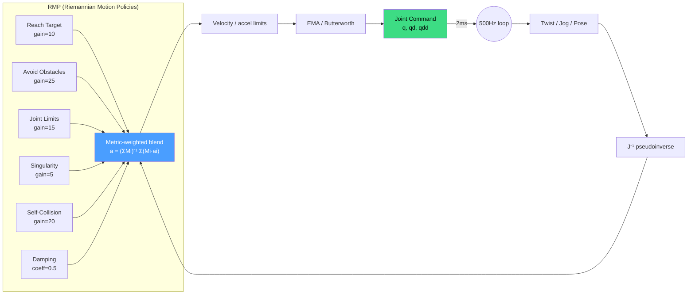

# Reactive Control

Motion planning computes a complete path before execution begins. If a new
obstacle appears mid-motion, the robot does not react. For teleoperation,
visual servoing, and dynamic environments, this is unacceptable.

Reactive control operates in a tight loop: read state, compute a small
joint-space correction, apply it, repeat. The controller generates commands
at 500Hz, fast enough that each correction is small and motion appears smooth.



## When to Use Reactive Control

Use **planning** when start, goal, and environment are known in advance.
Use **reactive control** when:

- **Teleoperation**: a human sends velocity commands via joystick or spacemouse.
- **Dynamic obstacles**: obstacles move during execution (people, other robots).
- **Visual servoing**: a camera provides a target pose that updates every frame.
- **Force-guided tasks**: assembly or insertion where contact forces modify motion.

## The Servo Loop

`Servo` converts high-level commands into safe joint velocities through a
pipeline: Jacobian inverse, velocity/acceleration limits, collision
deceleration. Three input modes are supported:

- **Twist**: Cartesian velocity (6D twist mapped to joints via Jacobian).
- **JointJog**: Direct velocity command for a single joint.
- **PoseTracking**: Proportional control toward a moving target pose.

```rust
use kinetic_reactive::{Servo, ServoConfig, InputType};

let servo = Servo::new(&robot, &scene, ServoConfig::default())?;

// Teleoperation: send a Cartesian twist
let cmd = servo.send_twist(&twist)?;
// cmd.positions, cmd.velocities, cmd.accelerations

// Or jog a single joint
let cmd = servo.send_joint_jog(2, 0.5)?;  // joint 2 at 0.5 rad/s

// Or track a moving target
let cmd = servo.track_pose(&target_pose)?;
```

## Singularity Handling

At a **singularity**, the Jacobian loses rank and some Cartesian directions
become unachievable. The naive pseudoinverse produces infinite joint
velocities. Kinetic uses the **damped pseudoinverse**:

```text
J_damped = J^T (J J^T + lambda^2 I)^{-1}
```

The damping factor lambda prevents blow-up. When manipulability drops below
the threshold (default: 0.02), damping increases and tracking accuracy is
sacrificed for safety. `ServoState` reports proximity:

```rust
let state = servo.state();
if state.is_near_singularity {
    warn!("Manipulability: {:.4} -- approaching singularity", state.manipulability);
}
```

## Collision Deceleration

The servo checks obstacle proximity at a configurable rate (default: 100Hz).
When the nearest obstacle is close, the controller intervenes:

- **Slowdown zone** (default: 15cm): scale down commanded velocities
  proportionally. At 15cm, full speed. At 3cm, nearly stopped.
- **Emergency stop** (default: 3cm): zero all velocities immediately.
  The servo returns a `ServoError::EmergencyStop` so the caller can
  distinguish a stop from a normal command.

These distances are configurable via `ServoConfig`:

```rust
let config = ServoConfig {
    slowdown_distance: 0.15,  // start slowing at 15cm
    stop_distance: 0.03,      // emergency stop at 3cm
    collision_check_hz: 100.0, // check rate
    ..ServoConfig::default()
};
```

## RMP: Riemannian Motion Policies

Real tasks require balancing multiple competing objectives simultaneously:
reach the target, avoid obstacles, stay away from joint limits, avoid
singularities. RMP provides a principled framework for combining these.
Each objective is a **policy** that produces:

1. A desired acceleration in its own task space.
2. A Riemannian metric tensor that weights how important that acceleration is.

Policies are **pulled back** to joint space via the Jacobian, then combined
via metric-weighted averaging:

```text
a_combined = (Sum M_i)^{-1} Sum(M_i * a_i)
```

The metric tensors encode directional importance. An obstacle avoidance
policy has a high metric toward the obstacle and near-zero elsewhere, so it
strongly prevents motion into the obstacle without interfering with motion
parallel to its surface.

```rust
use kinetic_reactive::{RMP, PolicyType};

let mut rmp = RMP::new(&robot)?;

// Attract end-effector toward target
rmp.add(PolicyType::ReachTarget {
    target_pose: goal_pose,
    gain: 10.0,
});

// Repel from scene obstacles
rmp.add(PolicyType::AvoidObstacles {
    scene: scene.clone(),
    influence_distance: 0.3,
    gain: 20.0,
});

// Stay away from joint limits
rmp.add(PolicyType::JointLimitAvoidance {
    margin: 0.1,  // radians from limit
    gain: 5.0,
});

// Avoid singular configurations
rmp.add(PolicyType::SingularityAvoidance {
    threshold: 0.05,
    gain: 15.0,
});

// Velocity damping for stability
rmp.add(PolicyType::Damping { coefficient: 0.5 });

// Compute combined command at 500Hz
let dt = 0.002;
let cmd = rmp.compute(&joint_positions, &joint_velocities, dt)?;
// cmd.positions, cmd.velocities, cmd.accelerations
```

## ServoConfig Presets

Three presets cover common scenarios:

| Preset     | Rate  | Input        | Slowdown | Stop  | Use Case              |
|------------|-------|--------------|----------|-------|-----------------------|
| `teleop()` | 500Hz | Twist        | 15cm     | 3cm   | Joystick, spacemouse  |
| `tracking()`| 500Hz | PoseTracking | 10cm     | 3cm   | Following a target    |
| `precise()` | 500Hz | Twist        | 8cm      | 1.5cm | Assembly, insertion   |

```rust
// Teleop (default)
let config = ServoConfig::teleop();

// Pose tracking with tighter collision checking
let config = ServoConfig::tracking();

// Precise manipulation with small movements per tick
let config = ServoConfig::precise();
```

The `precise` preset limits movement to 0.005 rad per tick with tighter
singularity damping and a 1.5cm stop distance -- appropriate for tasks
where sub-millimeter positioning matters.

## The 500Hz Control Pattern

```rust
let mut servo = Servo::new(&robot, &scene, ServoConfig::teleop())?;
let dt = Duration::from_secs_f64(0.002); // 500Hz

loop {
    let tick_start = Instant::now();
    let twist = read_twist_command();

    match servo.send_twist(&twist) {
        Ok(cmd) => send_to_robot(&cmd.positions),
        Err(ServoError::EmergencyStop { distance, .. }) => {
            warn!("Emergency stop at {distance:.3}m");
        }
        Err(e) => return Err(e.into()),
    }

    let elapsed = tick_start.elapsed();
    if elapsed < dt { std::thread::sleep(dt - elapsed); }
}
```

## See Also

- [Motion Planning](./motion-planning.md) -- offline planning as an alternative to reactive control
- [Collision Detection](./collision-detection.md) -- how collision deceleration detects nearby obstacles
- [Inverse Kinematics](./inverse-kinematics.md) -- the Jacobian and singularity concepts underlying servo control
- [Trajectory Generation](./trajectory-generation.md) -- converting planned paths to timed trajectories
