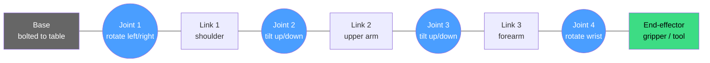
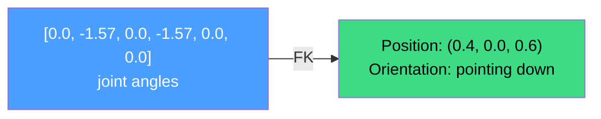
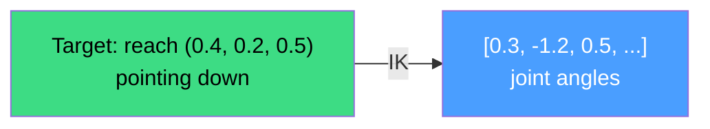
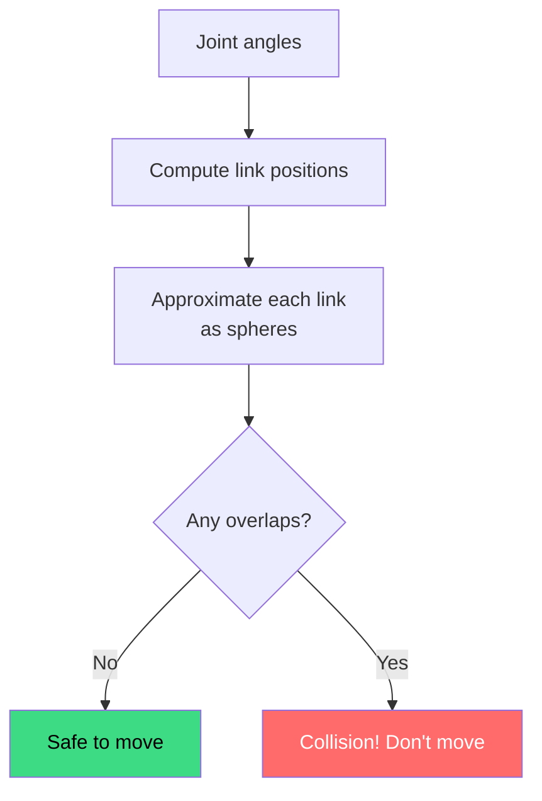
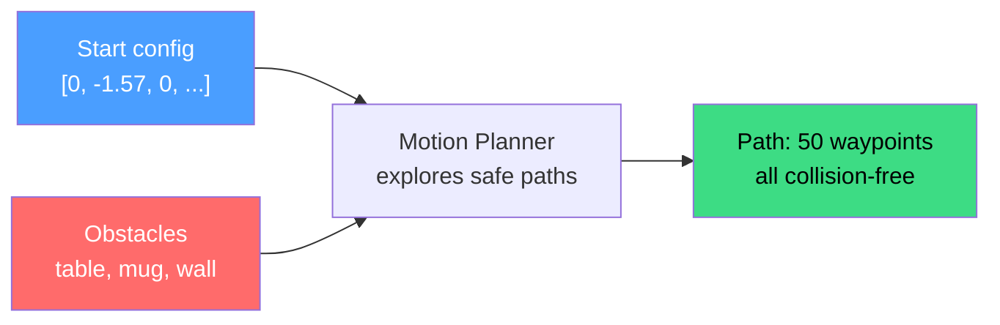
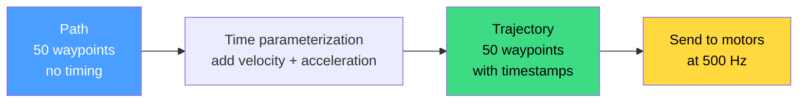
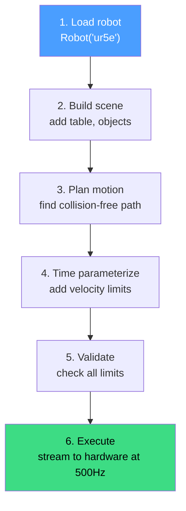

# Robotics Primer

New to robotics? This page explains the core ideas you need before using
kinetic. No prior robotics knowledge assumed -- just basic programming.

## What is a robot arm?

A robot arm is a chain of rigid metal pieces (**links**) connected by
motorized hinges (**joints**). Think of your own arm: your upper arm and
forearm are links, your elbow is a joint.



The **end-effector** (EE) is whatever's at the tip: a gripper, a welding
torch, a camera, or a suction cup. That's the part that does useful work.

## Degrees of freedom (DOF)

Each joint adds one **degree of freedom** -- one independent axis the robot
can move along. A typical industrial arm has 6 DOF (6 joints), which is
exactly enough to place the end-effector at any position *and* orientation
in 3D space. A 7-DOF arm (like the Franka Panda) has one extra joint,
giving it flexibility to reach the same pose in multiple ways.

| DOF | What it means | Example robots |
|-----|---------------|----------------|
| 3 | Can reach positions, but can't control orientation | Simple pick-place |
| 6 | Full position + orientation control | UR5e, KUKA, ABB |
| 7 | Redundant -- multiple ways to reach the same pose | Franka Panda, KUKA iiwa |

## Joint values: the robot's "configuration"

At any moment, each joint has an angle (in radians). The list of all joint
angles is called the **configuration** or **joint state**. For a 6-DOF
robot, it's a list of 6 numbers:

```python
joints = [0.0, -1.57, 0.0, -1.57, 0.0, 0.0]  # 6 angles in radians
```

This is the most fundamental concept in kinetic: nearly everything takes
a list of joint values as input.

## Forward kinematics: "where is the tool?"

Given a configuration (list of joint angles), **forward kinematics** (FK)
computes where the end-effector is in 3D space. The result is a **pose**:
a position (XYZ in meters) plus an orientation (which way the tool points).



FK is fast (324 nanoseconds) and always has exactly one answer.

```python
robot = kinetic.Robot("ur5e")
pose = robot.fk(joints)   # 4x4 matrix encoding position + orientation
print(pose[:3, 3])        # XYZ position in meters
```

## Inverse kinematics: "how do I reach this spot?"

**Inverse kinematics** (IK) is the reverse: given a desired pose for the
end-effector, find the joint angles that put it there.



IK is harder than FK because:
- There might be **multiple solutions** (elbow up vs. elbow down)
- There might be **no solution** (the target is out of reach)
- Near **singularities**, solutions become unstable

Kinetic has 10 different IK solvers -- it automatically picks the best one
for your robot.

```python
target = robot.fk([0.5, -1.0, 0.5, -0.5, 0.5, 0.0])
joints = robot.ik(target)  # finds joint angles that reach this pose
```

## Collision detection: "will I hit something?"

Before moving, we need to check: will the robot collide with the table,
a wall, or itself? Collision detection answers this in under a microsecond
by approximating the robot's links as simple shapes (spheres) and checking
for overlaps.



```python
scene = kinetic.Scene(robot)
scene.add("table", kinetic.Shape.cuboid(0.5, 0.5, 0.01), table_pose)
print(scene.check_collision(joints))  # True or False
```

## Motion planning: "find a safe path"

You know where you are (start) and where you want to be (goal). But you
can't just move in a straight line -- there might be obstacles in the way.

A **motion planner** explores possible paths through the robot's
configuration space and finds one that avoids all collisions. Think of it
like a GPS navigator for the robot's joints.



```python
planner = kinetic.Planner(robot, scene=scene)
goal = kinetic.Goal.joints([1.0, -0.8, 0.6, -0.5, 0.8, 0.3])
traj = planner.plan(start, goal)
```

## Trajectory: "how fast should I move?"

A planner gives you a **path** (a list of waypoints), but not *when* to
be at each point. A real motor needs to know: how fast should I spin at
each moment? **Trajectory generation** adds timing, velocity, and
acceleration to the path so the robot moves smoothly within its physical
limits.



```python
# traj already has timing (planner does it automatically)
print(f"Duration: {traj.duration:.2f} seconds")

# Sample at any point in time
joints_at_halfway = traj.sample(traj.duration / 2)
```

## URDF: the robot's blueprint

How does kinetic know what a UR5e looks like? From a **URDF file**
(Unified Robot Description Format) -- an XML file that describes every
link's shape, every joint's type and limits, and how they connect. Think
of it as a blueprint.

Kinetic ships 52 built-in robots so you don't need to write URDF files.
Just say `Robot("ur5e")` and it loads everything.

## Putting it all together

A typical robotics workflow in kinetic:



```python
import kinetic
import numpy as np

# 1. Load
robot = kinetic.Robot("ur5e")

# 2. Scene
scene = kinetic.Scene(robot)
scene.add("table", kinetic.Shape.cuboid(0.5, 0.5, 0.01), table_pose)

# 3. Plan
planner = kinetic.Planner(robot, scene=scene)
start = np.array([0.0, -1.57, 0.0, -1.57, 0.0, 0.0])
goal = kinetic.Goal.joints(np.array([1.0, -0.8, 0.6, -0.5, 0.8, 0.3]))
traj = planner.plan(start, goal)

# 4-5. Already done (planner auto-parameterizes and validates)

# 6. Execute
def send(positions, velocities):
    my_robot_driver.set_joints(positions)

executor = kinetic.RealTimeExecutor(rate_hz=500)
result = executor.execute(traj, send)
print(f"Done in {result['actual_duration']:.2f}s")
```

## Jargon cheat sheet

| Term | Plain English |
|------|--------------|
| **DOF** | Number of independent joints |
| **Configuration** | List of all joint angles |
| **FK** | Joint angles in, tool position out |
| **IK** | Tool position in, joint angles out |
| **C-space** | The imaginary space where each joint angle is one dimension |
| **Waypoint** | One configuration along a path |
| **Trajectory** | A path with timestamps and velocities |
| **End-effector** | The tool at the tip of the arm |
| **Singularity** | A configuration where the robot "locks up" mathematically |
| **URDF** | XML file describing a robot's geometry and joints |
| **Scene** | The robot's environment (tables, walls, objects) |
| **Planner** | Algorithm that finds collision-free paths |

## Next

Ready to code? Start here:

- **[Installation](../getting-started/installation.md)** -- get kinetic running
- **[Hello World](../getting-started/hello-world.md)** -- your first 5 lines
- **[Python Quickstart](../tutorials/python/quickstart.md)** -- full Python tutorial
