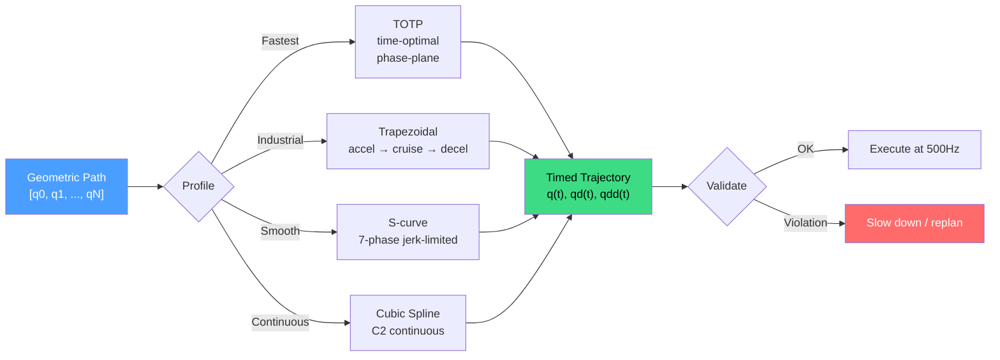

# Trajectory Generation

A motion planner produces a **path** -- a sequence of joint configurations
with no notion of time. A real robot cannot execute a path directly. It needs
to know *when* to be at each configuration: how fast to move, when to
accelerate, and when to stop. Trajectory generation converts a geometric path
into a **trajectory** -- the same configurations with timestamps, velocities,
and accelerations at each point.



## Why Timing Matters

Every robot joint has physical limits. Motors have maximum speeds. Gearboxes
have maximum torques, which constrain acceleration. Violating these limits
causes the motor controller to reject the command or the robot to fault.

A segment that moves a joint by 2 radians needs more time than one that moves
it by 0.1 radians at the same velocity limit. Trajectory generation computes
the correct timing for each segment so no joint ever exceeds its limits.

## Trapezoidal Velocity Profile

The simplest industrial profile. Each segment accelerates at maximum
acceleration, cruises at maximum velocity, then decelerates to rest:

```text
velocity
  ^
  |      ___________
  |     /           \
  |    /             \
  |   /               \
  +--/--+---+---+---+--\--> time
     accel  cruise  decel
```

If the segment is too short to reach maximum velocity, the cruise phase
vanishes and the profile becomes **triangular**. The slowest joint determines
the segment duration; all other joints are scaled to preserve the path shape.

```rust
use kinetic_trajectory::trapezoidal;

let path = vec![start_joints, via_point, goal_joints];
let traj = trapezoidal(&path, 1.5, 3.0)?;  // max_vel=1.5 rad/s, max_accel=3.0 rad/s^2
```

Trapezoidal profiles are fast to compute and widely used in industrial
automation. Their limitation is discontinuous acceleration at phase
transitions -- velocity is continuous but acceleration jumps instantaneously.

## TOTP: Time-Optimal Time Parameterization

TOTP finds the **fastest possible trajectory** along a geometric path
subject to per-joint velocity and acceleration limits. It uses phase-plane
analysis to compute switching points between maximum acceleration and
maximum deceleration for each joint independently.

The result is a trajectory where at least one joint is always at its limit.
This is equivalent to MoveIt2's TOTG.

```rust
use kinetic_trajectory::totp;

let traj = totp(
    &path,
    &velocity_limits,       // per-joint max velocity (rad/s)
    &acceleration_limits,   // per-joint max acceleration (rad/s^2)
    0.001,                  // path resolution
)?;
```

TOTP is the default choice when execution speed matters. For delicate tasks,
prefer jerk-limited profiles.

## Jerk-Limited S-Curve

Trapezoidal profiles produce infinite **jerk** (rate of change of
acceleration) at phase boundaries. This causes vibration and wear. The
S-curve profile constrains jerk to a finite maximum, producing seven phases:

```text
Phase 1: Jerk+   (acceleration ramps up)
Phase 2: Const accel  (acceleration holds at max)
Phase 3: Jerk-   (acceleration ramps down to zero)
Phase 4: Cruise   (constant velocity, zero acceleration)
Phase 5: Jerk-   (deceleration ramps up)
Phase 6: Const decel  (deceleration holds at max)
Phase 7: Jerk+   (deceleration ramps down to zero)
```

For short segments, some phases may vanish. The result is smoother motion
with continuous acceleration -- critical for painting, polishing, and CNC.

```rust
use kinetic_trajectory::jerk_limited;

let traj = jerk_limited(
    &path,
    2.0,    // max velocity (rad/s)
    5.0,    // max acceleration (rad/s^2)
    50.0,   // max jerk (rad/s^3)
)?;
```

## Cubic Spline Interpolation

Cubic splines fit cubic polynomials through waypoints, producing a
C2-continuous trajectory. Time is distributed proportionally to segment
arc-length. Unlike profile-based methods, splines do not enforce limits
during fitting -- validate the result with `TrajectoryValidator`.

```rust
use kinetic_trajectory::cubic_spline_time;

// Auto-compute duration from path length
let traj = cubic_spline_time(&path, None, Some(&velocity_limits))?;

// Or specify total duration explicitly
let traj = cubic_spline_time(&path, Some(3.0), None)?;
```

## Trajectory Blending

Robots rarely execute a single motion. A pick-and-place cycle chains
multiple trajectories. Without blending, the robot stops at each boundary.
Blending creates smooth parabolic transitions so the robot never pauses:

```rust
use kinetic_trajectory::{blend, blend_sequence};

// Blend two trajectories with a 0.2s transition
let combined = blend(&traj_approach, &traj_grasp, 0.2)?;

// Or blend an entire sequence
let full_cycle = blend_sequence(&[traj1, traj2, traj3, traj4], 0.15)?;
```

The blend region spans `blend_duration` seconds centered on the connection
point. Within this region, position is interpolated parabolically to
ensure continuous velocity and acceleration.

## Sampling a Trajectory

`TimedTrajectory` supports interpolated sampling at arbitrary times via
`sample_at()`. A real-time controller calls this at its control rate:

```rust
use std::time::Duration;

let traj = trapezoidal(&path, 1.5, 3.0)?;
let dt = Duration::from_secs_f64(0.002); // 500Hz
let mut t = Duration::ZERO;
while t <= traj.duration() {
    let wp = traj.sample_at(t);
    send_to_robot(&wp.positions);
    t += dt;
}
```

## Validation

Before sending a trajectory to real hardware, `TrajectoryValidator` checks
every waypoint against position limits, velocity limits, acceleration limits,
and optionally jerk bounds. A 5% safety factor (configurable) is applied
by default so that limits are not hit exactly at their maximum:

```rust
use kinetic_trajectory::{TrajectoryValidator, ValidationConfig};

let validator = TrajectoryValidator::new(
    &position_lower,
    &position_upper,
    &velocity_limits,
    &acceleration_limits,
    ValidationConfig {
        safety_factor: 1.05,       // 5% margin
        max_position_jump: 0.5,    // max 0.5 rad between waypoints
        max_jerk: Some(100.0),     // optional jerk bound (rad/s^3)
    },
);

match validator.validate(&traj) {
    Ok(()) => { /* safe to execute */ }
    Err(violations) => {
        for v in &violations {
            eprintln!("Joint {} at waypoint {}: {:?} (actual={:.3}, limit={:.3})",
                v.joint_index, v.waypoint_index,
                v.violation_type, v.actual_value, v.limit_value);
        }
    }
}
```

Running validation before execution is the last line of defense against
sending a dangerous trajectory to hardware.

## See Also

- [Motion Planning](./motion-planning.md) -- how geometric paths are generated
- [Reactive Control](./reactive-control.md) -- real-time control that bypasses trajectory generation
- [Forward Kinematics](./forward-kinematics.md) -- computing end-effector motion from joint trajectories
