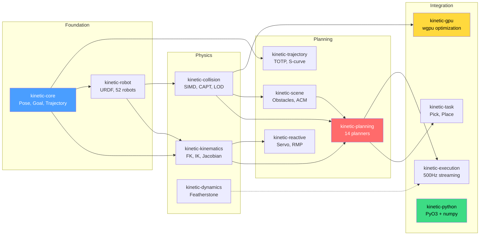

# Introduction

**Kinetic** is a fast, Rust-native motion planning library for robotics. It computes collision-free paths, solves inverse kinematics, and generates time-parameterized trajectories — all without ROS2, without a GPU, and without external dependencies.

```rust
use kinetic::prelude::*;

let result = plan("ur5e", &[0.0, -1.0, 0.8, 0.0, 0.0, 0.0],
                   &Goal::joints([1.0, -0.5, 0.3, 0.2, -0.3, 0.5]))?;
```

```python
import kinetic
traj = kinetic.plan("ur5e", start, kinetic.Goal.joints([1.0, -0.5, 0.3, 0.2, -0.3, 0.5]))
```

That's it. No launch files, no YAML configuration, no parameter server. Load a robot, define a goal, get a trajectory.

## What Kinetic Does

- **Forward & Inverse Kinematics** — 10 IK solvers including analytical (OPW, Paden-Kahan) and iterative (DLS, FABRIK, SQP, Bio-IK). FK in 324 ns, IK in 10 us.
- **Collision Detection** — SIMD-accelerated sphere-based checking with CAPT broadphase. Self-collision in 9 ns, environment collision in 507 ns.
- **Motion Planning** — 14 algorithms: RRT-Connect, RRT\*, BiRRT\*, BiTRRT, EST, KPIECE, PRM, CHOMP, STOMP, GCS, Cartesian, constrained, and dual-arm.
- **Trajectory Generation** — Time-optimal (TOTP), trapezoidal, jerk-limited S-curve, and cubic spline profiles with per-joint limit enforcement.
- **Reactive Control** — 500 Hz servo with twist/jog/pose-tracking inputs, RMP multi-policy blending, collision deceleration, and singularity avoidance.
- **Task Planning** — Pick, place, and multi-stage sequences with grasp generation and DAG-based stage composition.
- **GPU Optimization** — Optional wgpu compute shaders for parallel-seed trajectory optimization (cross-vendor: NVIDIA, AMD, Intel, Apple).
- **Python Bindings** — Full API via PyO3 with numpy integration. Type stubs for IDE autocomplete.
- **54 Built-in Robots** — UR, Franka Panda, KUKA, ABB, Fanuc, Kinova, xArm, and 47 more, ready to use.

## Performance vs MoveIt2

| Operation | Kinetic | MoveIt2 | Speedup |
|-----------|---------|---------|---------|
| Forward kinematics (7-DOF) | 324 ns | 5-10 us | **15-30x** |
| Inverse kinematics (DLS) | 10.6 us | 5 ms (KDL) | **470x** |
| Self-collision check | 9 ns | 50-100 us | **5,000x** |
| Environment collision (10 obstacles) | 507 ns | 50-100 us | **100x** |
| Servo control tick | 9.9 us | ~1 ms | **100x** |

## Architecture



## What Kinetic Does NOT Do

Kinetic is a planning and kinematics library, not a complete robotics framework. It does not include:

- **Hardware drivers** — Use [terra](https://github.com/softmata/terra) (HORUS HAL), ros2_control, or your own driver
- **Perception / object detection** — Feed detected shapes to kinetic's Scene API
- **Visualization** — Export trajectories to JSON/CSV, use matplotlib (Python), or connect via [horus-monitor](https://github.com/softmata/horus)
- **ROS2 middleware** — Kinetic runs standalone. For ROS2 integration, use the [horus-kinetic](https://github.com/softmata/kinetic/tree/main/crates/horus-kinetic) bridge

## Who Kinetic Is For

- **Robotics engineers** building manipulation systems who need fast, reliable motion planning
- **Teams migrating from MoveIt2** who want 10-5000x faster operations without ROS2 dependency
- **Python developers** prototyping robot behavior with numpy-native APIs
- **Product teams** deploying kinetic in production with 54 pre-configured robots and 85%+ test coverage

## Getting Started

New to kinetic? Start here:

1. **[Installation](getting-started/installation.md)** — `cargo add kinetic` or `pip install kinetic`
2. **[Hello World](getting-started/hello-world.md)** — Your first motion plan in 5 lines
3. **[Your First Robot](getting-started/your-first-robot.md)** — Load a robot and compute FK
4. **[Your First Plan](getting-started/your-first-plan.md)** — Plan, time-parameterize, and validate

Coming from another framework?

- **[From MoveIt2](migration/from-moveit2.md)** — Step-by-step migration with config translation
- **[From Other Frameworks](migration/from-other-frameworks.md)** — Concept mapping for cuRobo, Drake, OMPL, PyBullet

New to robotics?

- **[Robotics Primer](concepts/robotics-primer.md)** — What are joints, FK, IK, and planning? Explained from zero, no prior knowledge needed

Want to understand the algorithms?

- **[Core Concepts](concepts/glossary.md)** — Glossary, FK, IK, collision, planning, trajectories explained
- **[Planner Selection](guides/planner-selection.md)** — Decision flowchart for choosing the right algorithm
