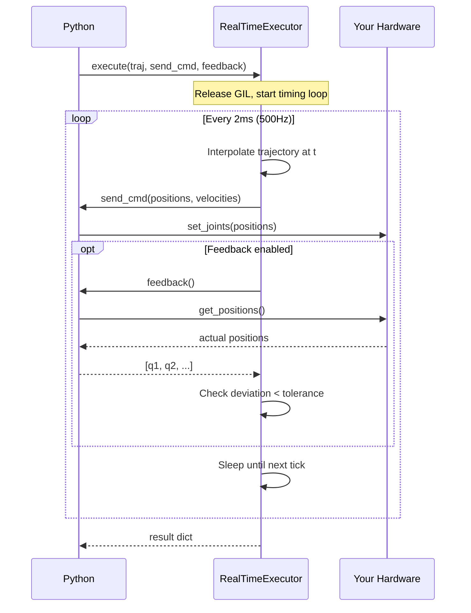

# Hardware Execution in Python

Deploy trajectories to real robots using `RealTimeExecutor`. Streams
joint commands to your hardware driver at precise rates (up to 500 Hz)
via a Python callback, with optional feedback for deviation monitoring.

## The pattern



Your callback receives numpy arrays of positions and velocities. kinetic
handles timing, interpolation, and safety monitoring.

## Basic execution

Define a callback that sends commands to your robot:

```python
import kinetic
import numpy as np

robot = kinetic.Robot("ur5e")

# Your hardware driver callback
def send_command(positions, velocities):
    # positions: numpy (6,) -- joint positions in radians
    # velocities: numpy (6,) -- joint velocities in rad/s
    print(f"  cmd: {np.round(positions, 3)}")
    # In real code: my_driver.set_joints(positions, velocities)

# Plan a trajectory
start = np.array([0.0, -1.57, 0.0, -1.57, 0.0, 0.0])
goal = kinetic.Goal.joints(np.array([0.5, -1.0, 0.5, -0.5, 0.5, 0.0]))
traj = kinetic.plan("ur5e", start, goal)

# Execute at 100 Hz
executor = kinetic.RealTimeExecutor(rate_hz=100)
result = executor.execute(traj, send_command)

print(f"State: {result['state']}")
print(f"Duration: {result['actual_duration']:.3f}s")
print(f"Commands sent: {result['commands_sent']}")
```

## Safe execution with feedback

For real robot deployments, use `RealTimeExecutor.safe()` which enables
joint limit validation and requires a feedback source:

```python
def send_command(positions, velocities):
    my_driver.set_joints(positions, velocities)

def read_feedback():
    """Return current joint positions, or None if unavailable."""
    pos = my_driver.get_joint_positions()
    return list(pos) if pos is not None else None

executor = kinetic.RealTimeExecutor.safe(robot, rate_hz=500)
result = executor.execute(traj, send_command, feedback=read_feedback)

if result["max_deviation"] is not None:
    print(f"Max tracking error: {result['max_deviation']:.4f} rad")
```

`safe()` automatically:
- Validates all waypoints against the robot's joint limits before execution
- Requires the feedback callback
- Sets tight command timeout (50ms)
- Aborts if position deviation exceeds 0.1 rad

## Configuration

```python
executor = kinetic.RealTimeExecutor(
    rate_hz=500,              # Command frequency (Hz)
    position_tolerance=0.05,  # Max allowed deviation (rad)
    command_timeout_ms=50,    # Abort if callback takes >50ms
    timeout_factor=2.0,       # Abort if execution takes >2x expected
    require_feedback=True,    # Feedback callback is mandatory
)
```

## Error handling

The executor raises `RuntimeError` on failure. Common errors:

```python
try:
    result = executor.execute(traj, send_command, feedback=read_feedback)
except RuntimeError as e:
    error_msg = str(e)
    if "DeviationExceeded" in error_msg:
        print("Robot drifted too far from planned path -- check hardware")
    elif "CommandFailed" in error_msg:
        print("Hardware driver returned an error")
    elif "Timeout" in error_msg:
        print("Execution took too long -- check for mechanical binding")
    elif "empty trajectory" in error_msg:
        print("Trajectory has no waypoints")
    else:
        print(f"Execution error: {e}")
```

## Result dict

The execute() method returns a dict:

| Key | Type | Description |
|-----|------|-------------|
| `state` | str | `"Completed"`, `"Error"`, etc. |
| `actual_duration` | float | Wall-clock execution time (seconds) |
| `expected_duration` | float | Trajectory duration (seconds) |
| `commands_sent` | int | Number of commands streamed |
| `final_positions` | numpy | Last commanded joint positions |
| `max_deviation` | float or None | Largest position error (if feedback provided) |

## Comparison: three executors

| Executor | Timing | Use case |
|----------|--------|----------|
| `SimExecutor` | Instant (no sleep) | Unit tests, validation |
| `LogExecutor` | Instant + records commands | Debugging, replay analysis |
| `RealTimeExecutor` | Real wall-clock timing | Actual robot hardware |

```python
# Validation first
sim = kinetic.SimExecutor()
sim_result = sim.execute(traj)
assert sim_result["state"] == "Completed"

# Inspect commands
log = kinetic.LogExecutor(rate_hz=500)
log.execute(traj)
commands = log.commands()
print(f"Would send {len(commands)} commands")

# Then deploy
executor = kinetic.RealTimeExecutor.safe(robot)
result = executor.execute(traj, send_command, feedback=read_feedback)
```

## UR robot example

A complete example for Universal Robots (using ur_rtde or similar):

```python
import kinetic
import numpy as np
# import rtde_control  # your UR driver

robot = kinetic.Robot("ur5e")

# Plan
start = np.array([0.0, -1.57, 0.0, -1.57, 0.0, 0.0])
goal = kinetic.Goal.named("home")
traj = kinetic.plan("ur5e", start, goal)

# Validate before deploying
vel = np.array(robot.velocity_limits)
acc = np.array(robot.acceleration_limits)
violations = traj.validate(
    np.full(6, -6.28), np.full(6, 6.28), vel, acc,
)
assert not violations, f"Trajectory has violations: {violations}"

# Check dynamics feasibility
dyn = kinetic.Dynamics(robot)
times, positions, velocities = traj.to_numpy()
for i in range(len(times)):
    tau = dyn.inverse_dynamics(positions[i], velocities[i], np.zeros(6))
    # Check against motor limits...

# Deploy
# rtde = rtde_control.RTDEControlInterface("192.168.1.100")
# def send(pos, vel):
#     rtde.servoJ(pos.tolist(), vel.tolist(), 0.002, 0.1, 500)
# def feedback():
#     return rtde.getActualQ()

# executor = kinetic.RealTimeExecutor.safe(robot, rate_hz=500)
# result = executor.execute(traj, send, feedback=feedback)
```

## Next

- [Dynamics](dynamics.md) -- torque feasibility checking
- [GPU Acceleration](gpu-acceleration.md) -- faster trajectory optimization
- [Pick and Place](pick-and-place.md) -- full manipulation workflow
